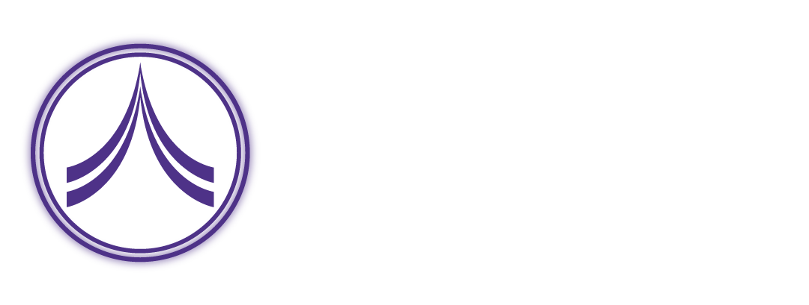
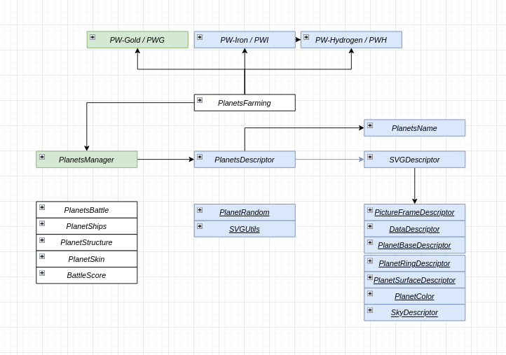
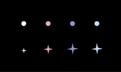
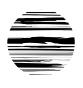
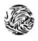
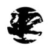
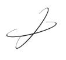
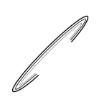
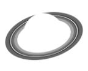

# PlanetWars - Official repository 

## Presentation

Planet wars is a Play-To-Earn space battle game, based on the
Binance Smart Chain that includes concepts of NFT, DeFi and
Gamification.

This document is intended as a support and technical explanation on the project

## Tool
Hardhat environment, typescript, openzeppelin

## Flow diagram

This chart may undergo changes as the project progresses at the discretion of the developers
-  `Deployed`
-  `Ready to deploy`
-  `Under development`
- <ins>_ABC_</ins> `Library`

## Contract explanation
### BEP20
**PW-Gold**, **PW-Hydrogen**, **PW-Iron** are mintable BEP20 and follow different tokenomics.
Gold are capped with 100M max supply, hydrogen and iron are no capped with a different emission and utility.
All three contract are upgradable to be able to add useful functions to the future development of the game

### BEP721
**PlanetsManager** is a standard BEP721 and manage mint and its price increase.
The uri token image and metadata is sent back to the **PlanetsDescriptor** based on unveilBlockHash set in PlanetsManager

### UnveilBlockHash
The unveilBlockHash is the variable that is saved on the smart contract and that will determine the randomness of the 
metadata and image of the planets.
This system was designed to ensure a healthier economy for the minting phase and the project, and try to prevent 
practices that are not healthy for the game and the whole project.
So every planet minted after the date of unveil will be saved the blockhash of the block preceding the mint and 
it will be used to determine its randomness in addition to the unveilBlockHash

### Image
**SVGDescriptor** is the contract that manages the return of the images in SVG
The various libraries are called up passing the data they need to return their own SVG layer

#### LayerSVG

**SkyDescriptor** can return 4 type of sky based from coordinated with different path.

**SkyCircle** and **SkyRhombus** add figures of random size and position to the background

**SkySurface** can return 4 type of surface based from habitability which thanks to SVG techniques have a rotation effect with random speed

**SkyRing** can return 3 type of ring based from habitability

**PictureFrame** and **DataDescriptor** that enclose the planet and display the metadata

**PlanetColor** can return 10 color palettes that have different combinations within them

### Planets name
**PlanetsName** contract are versionable and allows planet owners to name and see it appear on their NFTs
